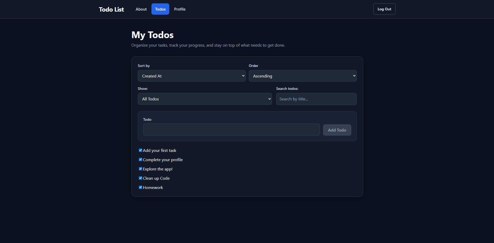
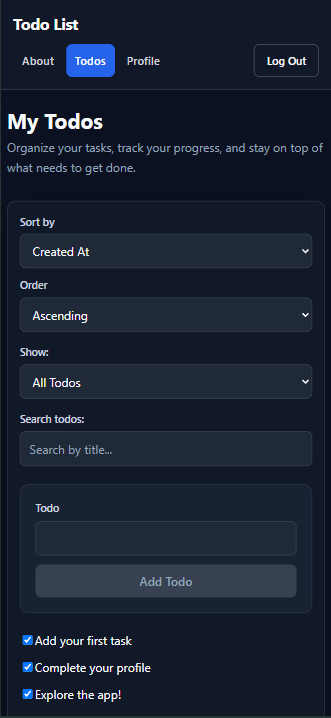

# My Todos

A responsive Todo application built with React that allows users to create, organize, edit, complete, search, filter, and sort their tasks. The application uses authentication and a backend API so todos persist between sessions.

## Features

- User authentication with login and logout
- Create new todos
- Edit existing todos
- Mark todos as completed
- View all, active, or completed todos
- Search todos by title
- Sort todos by title or creation date
- Sort in ascending or descending order
- View todo statistics from the Profile page
- Protected routes for authenticated users
- Persistent todo data using a backend API
- Loading, error, and empty states
- Responsive design for desktop and mobile devices
- Accessible form labels, focus states, and controls

## Technologies Used

- React
- React Router
- Vite
- JavaScript
- CSS Modules
- HTML
- CTD Todo List API

## Screenshots

### Desktop View



### Mobile View



## Getting Started

### Prerequisites

Before running the project, make sure you have:

- Node.js
- npm
- Git

### Installation

1. Clone the repository:

```bash
git clone https://github.com/giddydavis1020/ctd-swag.git
```

2. Navigate into the project:

```bash
cd ctd-swag
```

3. Install the dependencies:

```bash
npm install
```

4. Create a `.env` file in the project root and add:

```env
VITE_TARGET=https://ctd-learns-node-l42tx.ondigitalocean.app
```

5. Start the development server:

```bash
npm run dev
```

6. Open the local address displayed by Vite in your browser.

The development server is configured to run on port `3001`.

## Available Scripts

### Development

```bash
npm run dev
```

Starts the Vite development server.

### Build

```bash
npm run build
```

Creates an optimized production build of the application.

### Preview

```bash
npm run preview
```

Runs the production build locally for testing.

## Design Decisions

I chose CSS Modules to keep component styles organized and scoped to individual components.

The application uses a dark color scheme with blue accents to create a clean and consistent interface. Form controls, navigation elements, todo items, and buttons use consistent spacing and styling throughout the application.

The layout is responsive so controls stack vertically on smaller screens while making better use of available space on larger displays. Interactive elements include hover, focus, disabled, and active states to provide clear feedback to users.

## Future Improvements

Some features I would like to add in the future include:

- Todo deletion
- Todo priority levels
- Due dates and reminders
- Categories or tags
- Additional profile customization
- Additional accessibility improvements
- More customization options for the interface

## License

This project is licensed under the MIT License.

## Contact

GitHub: [giddydavis1020](https://github.com/giddydavis1020)